# Overview
- During my internship at Cognifyz Technologies, I completed a data analysis project focused on the restaurant industry. The project aimed to uncover actionable insights from restaurant data to optimize operations and enhance decision-making.

# Analysis
## Level 1:
## 1. Determine the top three most common cuisines in the dataset and calculate the percentage of restaurants that serve each of the top cuisines.

### Visualize Data
```python

sns.set_theme(style='ticks')
sns.barplot(data=top_three_cuisines, x='percentage', y='Cuisines', hue='percentage', palette='dark:b_r', legend=False)
plt.title('Top 3 most common cuisines served in restaurants')
plt.ylabel('')
plt.xlabel('Percentage of restaurants serving the cuisine')
plt.xlim(0, 45)
ax = plt.gca()
ax.xaxis.set_major_formatter(plt.FuncFormatter(lambda x, _: f'{int(x)}%'))
for value in top_three_cuisines['percentage']:
    plt.text(value+1, top_three_cuisines['Cuisines'][top_three_cuisines['percentage'] == value], f'{value}%', color='black', ha='left')
sns.despine()
plt.show()

```

### Results 
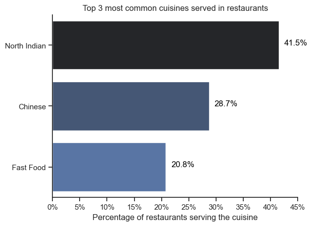

### Insights 

- Customer Preference: Focus on North Indian cuisine (41.5%) as it dominates, while offering Chinese (28.7%) or Fast Food (20.8%) to attract a broader audience.
- Delivery Focus: Prioritize delivery services for Chinese and Fast Food, which are convenience-driven.
- Pricing Strategy: Use affordable pricing for Chinese and Fast Food; focus on dine-in for North Indian meals.
- Festive Menus: Offer seasonal deals for North Indian cuisine during festivals and peak demand times.


## 2. Identify the city with the highest number of restaurants in the dataset. Calculate the average rating for restaurants in each city. Determine the city with the highest average rating? 

### Visualize Data

a. Cities with Most number of restaurants
```python
sns.set_theme(style='ticks')
sns.barplot(data=cities_with_most_restaurants, x='City', y='count', hue='count', palette='dark:b_r', legend=False)
plt.xticks(rotation=45)
plt.title('Cities with the most number of restaurants')
plt.ylabel('Number of Restaurants')
plt.xlabel('')
for value in cities_with_most_restaurants['count']:
    plt.text(cities_with_most_restaurants['count'].values.tolist().index(value), value, str(value), ha='center', va='bottom')
sns.despine()
plt.show()

```
### Results 
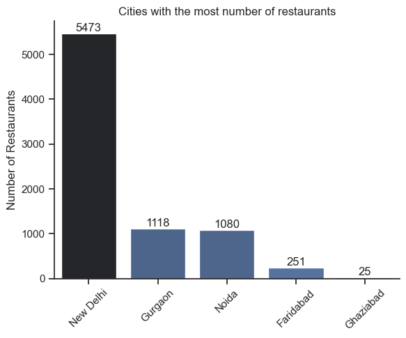

b. Cities with Highest ratings
```python
sns.swarmplot(data=cities_with_highest_rating_resturants, x='City', y='Aggregate rating', color='black')
plt.xticks(rotation=45, ha='right')
plt.title('Top 10 Cities with the highest rated restaurants')
plt.ylabel('Average Rating')
for index, value in enumerate(cities_with_highest_rating_resturants['Aggregate rating']):
    plt.text(index, value+0.01, str(value), ha='center', va='bottom')
plt.xlabel('')
sns.despine()
plt.tight_layout()
plt.show()

```
### Results 
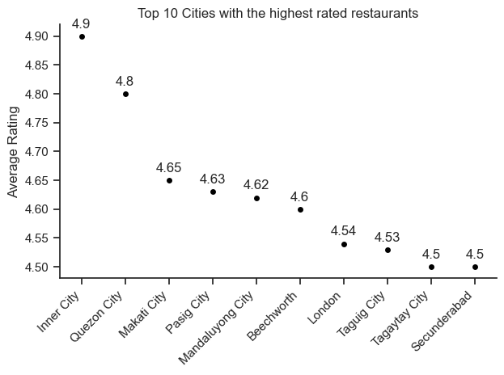

c. Ratings for the cities with most numbers of restaurants
```python
sns.swarmplot(data=df1, x='City', y='mean', color='black')
plt.xticks(rotation=45, ha='right')
plt.title('Average rating for top 10 cities with the most number of restaurants')
plt.ylabel('Average Rating')
plt.ylim(0, 5.0)
for index, value in enumerate(df1['mean']):
    plt.text(index, value+0.01, str(value), ha='center', va='bottom')
plt.xlabel('')
sns.despine()
plt.tight_layout()
plt.show()

```
### Results 
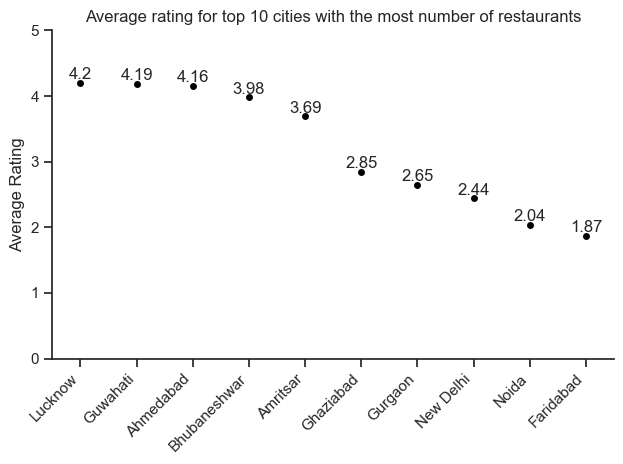

### Insights 

### Conclusion  

- New Delhi vs. High Ratings: Despite having the most restaurants, New Delhi does not appear in the top-rated cities, suggesting potential gaps in quality.
- Growth Opportunities: Faridabad and Ghaziabad could benefit from more restaurants, while cities with high ratings like Inner City and Quezon City can leverage their reputation for further growth.
- Customer Preferences: Cities with high ratings indicate a focus on service and food quality, which can serve as benchmarks for underperforming regions.


## 3. Create a histogram or bar chart to visualize the distribution of price ranges among the restaurants. Calculate the percentage of restaurants in each price range category.

### Visualize Data
```python
sns.boxplot(data=df_US_top6, x='salary_year_avg', y='job_title_short', order=order)
sns.set_theme(style='ticks')

plt.title('Salary distribution for the top 6 data roles')
plt.ylabel('')
plt.xlabel('Yearly salary ($USD)')
plt.xlim(0, 600000)
ax = plt.gca()
ax.xaxis.set_major_formatter(plt.FuncFormatter(lambda x, __: f'${int(x/1000)}k'))
plt.show()


```
### Results 
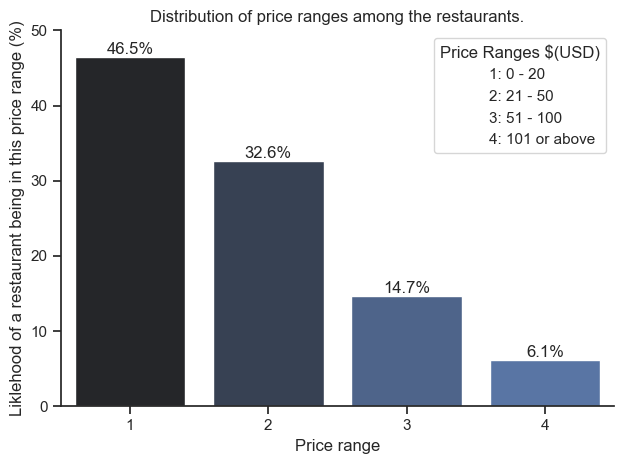


### Insights 

- Most restaurants are budget-friendly: This means lots of competition in that area, but also high demand.
- Higher prices, less competition: If you offer a premium experience, there's a niche market for it.
- Know your target customer: Who are you trying to attract? Budget diners, families, or the elite?
- Price competitively: Don't overprice yourself out of the market, or undersell your quality.
- Market smart: Use promotions that fit your price point (value deals vs. luxury experiences).


## 4. Determine the percentage of restaurants that offer online delivery. Compare the average ratings of restaurants with and without online delivery.

### Visualize Data

a. Percentage of restaurants that offer online delivery:
```python

df_online_delievery['Has Online delivery'].value_counts().plot(kind='pie', startangle=90, autopct='%1.1f%%')
plt.ylabel('')
plt.title('Online Delivery Done By Restaurants')
plt.show()

```
### Results 
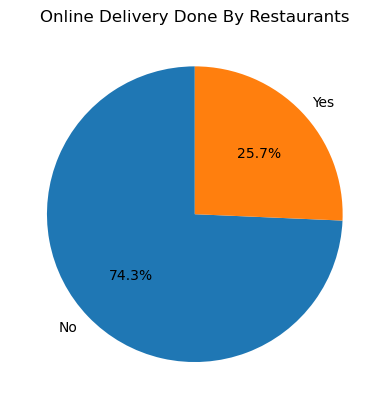

b. Average rating for the restaurants with and without online delivery:
```python

sns.set_theme(style='ticks')
sns.barplot(data=df_plot, x=df_plot.index, y=df_plot['Aggregate rating'], hue='Aggregate rating', palette='dark:b_r', legend=False)
for idx, value in enumerate(df_plot['Aggregate rating']):
    plt.text(idx, value+0.05, round(value, 2), ha='center')
plt.ylabel('Average Rating for the restaurants')
plt.ylim(0, 4)
plt.title('Average Rating for the restaurants with and without online delivery')
sns.despine()
plt.tight_layout()
plt.show()

```
### Results 
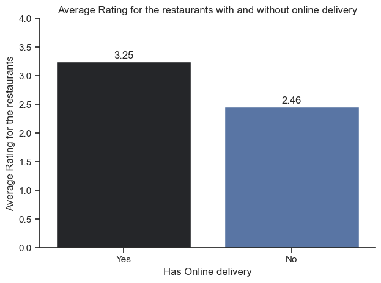

### Insights 

- Online delivery is linked to happier customers: Restaurants offering it have higher ratings, likely due to convenience and wider reach.
- If you don't offer delivery, consider it: It could boost your customer satisfaction and attract new diners.
- Don't neglect quality: Even with delivery, good food and service are key. Make sure the delivery experience doesn't disappoint.
- Promote your delivery option: Let people know you offer this convenient service!


## Level 2:
## 1. Analyze the distribution of aggregate ratings and determine the most common rating range. Calculate the average number of votes received by restaurants.

### Visualize Data
```python

sns.set_theme(style='ticks')
sns.barplot(data=df_plot, x='Restaurant ID', y=df_plot.index, hue='Restaurant ID', palette='dark:b_r', legend=False)
plt.title('Distribution of Range of Aggregate Ratings')
plt.ylabel('Range of Aggregate Ratings')
ax = plt.gca()
ax.invert_yaxis()
plt.xlabel('Count')
for index, value in enumerate(df_plot['Restaurant ID']):
    plt.text(value+200, index, str(value), ha='center', va='center')
sns.despine()
plt.show()

```
### Results 
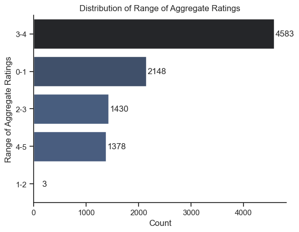

### Insights 

- The majority of restaurants have aggregate ratings between 3 and 4.
- A substantial number of restaurants have ratings between 0 and 1.
- The number of restaurants decreases as the rating range increases beyond 3-4, with relatively few restaurants achieving ratings between 4 and 5.
- Extremely few restaurants have ratings between 1 and 2.


## 2. Identify the most common combinations of cuisines in the dataset. Determine if certain cuisine combinations tend to have higher ratings.

### Visualize Data
```python

df_cuisine_pair_plot = df_pair_counts.head().copy()
df_cuisine_pair_plot['Cuisine_Pair'] = df_cuisine_pair_plot['Cuisine_Pair'].astype(str)
sns.set_theme(style='ticks')
sns.barplot(data=df_cuisine_pair_plot, x='Count', y='Cuisine_Pair', hue='Count', palette='dark:b_r', legend=False)
plt.title('Common Combinations Of Cuisines and their Counts')
plt.xlabel('')
for idx, value in enumerate(df_cuisine_pair_plot['Count']):
    plt.text(value+50, idx, value, ha='center', va='center')
sns.despine()
plt.show()

```
### Results 
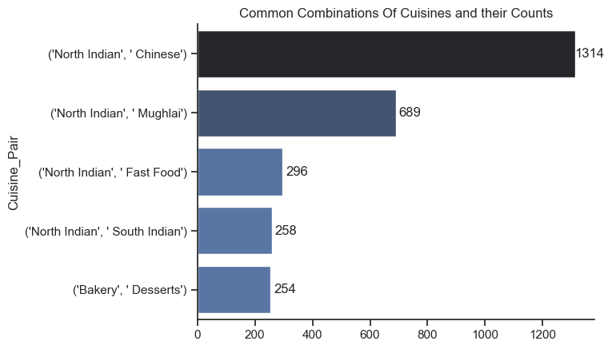

### Insights 

- North Indian food is super popular! It's most often paired with other cuisines, especially Chinese.
- North Indian and Chinese is the top combo. People love this mix!
- North Indian also goes well with Mughlai food. A classic pairing.
- Other combos with North Indian are less common. This might mean they're less popular or just not offered as much.
- Bakery and Desserts is a common pairing on its own. Think cafes and sweet shops.


## 3. Plot the locations of restaurants on a map using longitude and latitude coordinates. Identify any patterns or clusters of restaurants in specific areas.

### Visualize Data
```python

fig = px.scatter_geo(df_map, lat='Latitude', lon='Longitude', hover_name='Restaurant Name', projection="natural earth")
fig.update_layout(margin={"r":0,"t":40,"l":0,"b":0})
fig.show()

```
### Results 
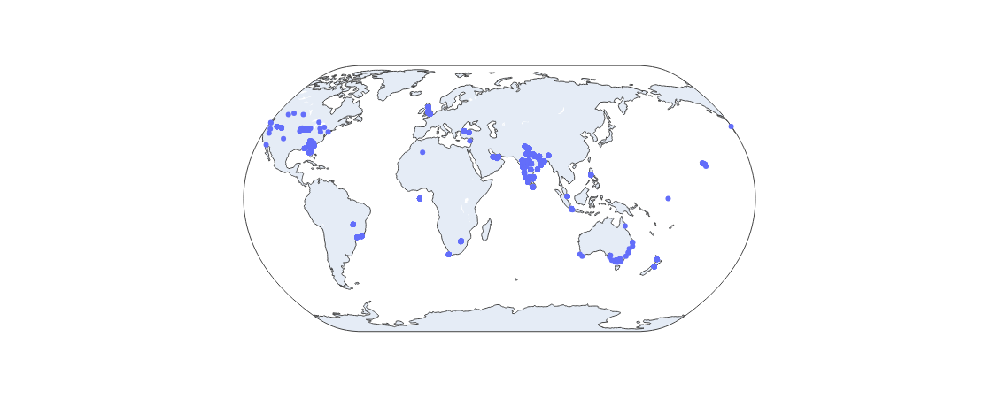

### Insights 

- **North America**: Particularly in the eastern and western regions of the United States. This suggests a high concentration in metropolitan areas like New York, Los Angeles, and Chicago.
- **Europe**: A dense cluster is evident across central and western Europe, possibly indicating popular urban centers like London, Paris, and Berlin.
- **South Asia**: Significant clusters appear in countries like India and Southeast Asia, possibly reflecting a high density in cities like Mumbai, Bangkok, and Singapore.
- **Australia**: A noticeable concentration along the eastern coast, likely in cities like Sydney, Melbourne, and Brisbane.
- **Africa**: Sparse clustering is evident, with a few dots in the southern region, likely near urban centers such as Johannesburg or Cape Town.
- **East Asia**: Notable clusters appear in areas like Japan and South Korea.
The patterns suggest that the restaurants are concentrated in urban and highly populated regions, likely targeting areas with significant foot traffic and economic activity.


## 4. Identify if there are any restaurant chains present in the dataset. Analyze the ratings and popularity of different restaurant chains.

### Insights 

**Branch Count (Popularity)**:

- Cafe Coffee Day (83 branches) is the most widespread, followed by Domino's Pizza (79), and Subway (63).
- McDonald's, with 48 branches, has fewer outlets but stands out in ratings.

**Ratings (Mean)**:

- McDonald's has the highest rating among large chains (3.34), indicating consistent quality.
- Cafe Coffee Day has the most branches but a relatively low rating (2.42), suggesting room for improvement.
- Domino's Pizza and Subway have average ratings (2.74 and 2.91, respectively).

**Small Chains**:
- Smaller chains like Ghar Bistro Cafe and 'ukura Sofras۱ have high ratings (4.4), likely due to localized excellence.

**Insights**:
- Large chains often trade quality for scalability, while smaller chains maintain higher satisfaction levels. Notable exceptions include McDonald's, which balances both well.

## Level 3:
## 1. Analyze the text reviews to identify the most common positive and negative keywords. Calculate the average length of reviews and explore if there is a relationship between review length and rating.


### Insights 

- Shorter reviews (1 word) have a higher average rating (3.32), suggesting they are more positive. 
- Longer reviews (2 words) have a lower average rating (1.39), implying they are more critical.
- Positive Sentiment: The words "Excellent," "Very Good," and "Good" are the positive keywords, with a significant count of reviews reflecting positive feedback.
- Negative Sentiment: "Poor" and "Not rated" indicate negative or neutral feedback, with "Not rated" having the highest count.

## 2. Identify the restaurants with the highest and lowest number of votes. Analyze if there is a correlation between the number of votes and the rating of a restaurant.

### Insights 
- Top 20:
    - High Votes (5,500–28,000): Stabilize ratings, making them reliable and reflective of diverse feedback.
    - Ratings Trend: Mostly above 4.0, showing customer satisfaction. Outliers (e.g., Domino's) face unmet expectations despite popularity.
    - Visibility: High exposure drives votes and strengthens market position.

- Bottom 20:
    - Low Votes (4 for all): Ratings (2.7–3.1) are less representative due to limited feedback.
    - Ratings Trend: Tight clustering reflects mediocrity or lack of strong customer impressions.
    - Visibility: Minimal market reach and engagement hinder growth.

- Insights:
    - Votes Stabilize Ratings: Higher votes = reliable ratings; lower votes = variability.
    - Growth Opportunity: Bottom 20 must improve visibility and quality to attract more votes and stabilize ratings.

## 3. Analyze if there is a relationship between the price range and the availability of online delivery and table booking. Determine if higher-priced restaurants are more likely to offer these services.

### Visualize Data
```python

df_copy.plot(kind='bar', x='Price range', y=[('Has Table booking', 'Yes'), ('Has Online delivery', 'Yes')], figsize=(10, 6))
plt.xticks(rotation=0)
plt.ylabel("Percentage of Restaurants (%)")
plt.title("Number of Restaurants by Price Range")
plt.legend(["Has Table Booking", "Has Online Delivery"])
ax = plt.gca()
ax.yaxis.set_major_formatter(plt.FuncFormatter(lambda x, _: f'{x}%'))
ax.spines['top'].set_visible(False)
ax.spines['right'].set_visible(False)
for idx, val in enumerate(df_copy['Has Table booking']['Yes']):
    plt.text(idx-0.18, val, f"{val}%", va='bottom', color='black')
for idx, val in enumerate(df_copy['Has Online delivery']['Yes']):
    plt.text(idx+0.06, val, f"{val}%", va='bottom', color='black')
plt.show()

```
### Results 
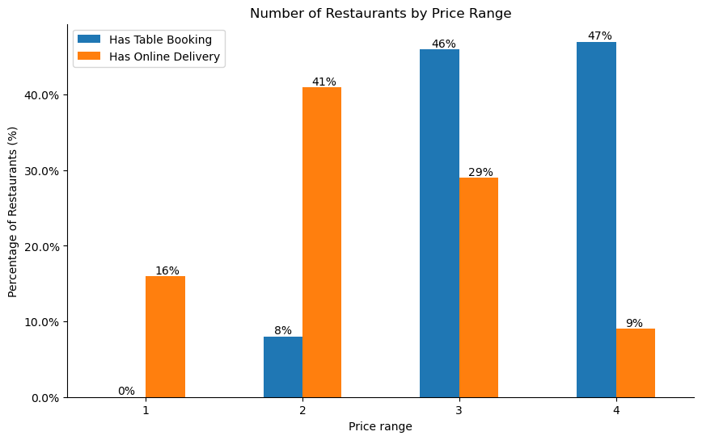

### Insights 

- Higher-priced restaurants prioritize table booking services, likely catering to dine-in customers.
- Mid-range restaurants focus more on online delivery, aligning with convenience-focused customers.
- Cheaper restaurants have limited services, focusing primarily on affordability.
- This suggests that businesses in higher price ranges should focus on enhancing the dine-in experience, while mid-range restaurants can gain an edge by optimizing delivery services.
